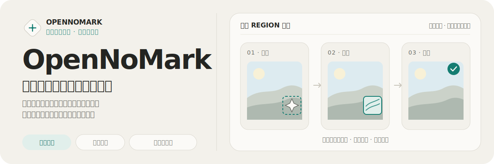
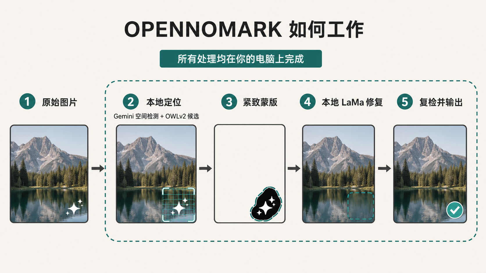

<p align="center">
  
</p>

<p align="center">
  <a href="./README.md">English</a> · <strong>简体中文</strong>
</p>

OpenNoMark 将多专家水印定位与 LaMa 内容感知修复结合起来：保留 Gemini、豆包、千问、即梦、可灵、腾讯元宝、百度等平台的校准快路径，同时增加一条保守的通用分支，用于识别不在角落的紧凑型可见文字水印。完整处理流程都运行在你自己的电脑上。

> 本项目处理的是图片上肉眼可见的覆盖层，不会修改或移除不可见的来源元数据与 Content Credentials。

[Web 工作台](#web-工作台) · [真实效果](#真实图片效果) · [安装使用](#选择适合你的使用方式) · [技术原理](#技术原理) · [数据集与验证](#数据集与验证)

## Web 工作台

响应式工作台同时照顾单图精修和长批次任务：尚未结束的图片继续处理时，已完成结果仍可查看和下载；每一张图都保留自己的状态、重试入口与操作路径，在桌面端和移动端都能清楚使用。

<!-- 此文件必须来自真实运行中的前端截图，不要使用设计稿或合成图。 -->


### 为什么这套流程始终可复核

| 批量处理，也不丢失上下文 | 先检查，再保存 | 默认本地运行 |
| :--- | :--- | :--- |
| 上传一张或整批图片，每个文件都有独立的排队、上传、处理、完成与失败状态。 | 对比原图和结果，单独重试失败项，下载某一张，或把全部完成结果打包为 ZIP。 | 检测与重建都在本机执行，应用不会把图片提交到托管推理 API。 |

Web UI、命令行、Python API 与跨 Agent Skill 共用同一套处理核心。你可以从可视化操作开始，再自然过渡到批处理与自动化，并在每种工作流中获得相同的结果语义。

### 一套自然的批量流程

1. 拖入或选择 PNG、JPEG、WebP 图片。
2. 开始处理待完成图片，分别跟踪每一项的状态。
3. 打开任意已完成图片，拖动查看处理前后对比。
4. 直接下载单张、重试失败项，或将全部完成结果导出为 ZIP。
5. 继续添加新图片时，已经完成的结果不会被重复处理。

界面提供英文与简体中文切换。

## 真实图片效果

下面展示的是仓库中的真实文件，而不是设计效果图。每组左侧为原图，右侧为对应的 OpenNoMark 处理结果。

### Gemini · 覆盖复杂前景纹理的星芒水印

| 原图 | 处理后 |
| :---: | :---: |
|  |  |

### 豆包 · 当前版图标与文字签名

| 原图 | 处理后 |
| :---: | :---: |
|  |  |

### 千问 · 图标与文字签名

| 原图 | 处理后 |
| :---: | :---: |
|  |  |

LaMa 会根据周围内容重建蒙版区域，而不是简单模糊水印。最终效果仍会受水印形态、对比度和底层纹理影响；重要图片请务必在对比视图中复核。

## 选择适合你的使用方式

### 1. Web UI · 适合可视化检查与批量任务

环境要求：Python 3.10+、[uv](https://docs.astral.sh/uv/) 与 Node.js/npm。建议使用至少 16 GB 内存的设备。

```bash
git clone https://github.com/NanmiCoder/OpenNoMark.git
cd OpenNoMark

# macOS / Linux
./start.sh

# Windows
start.bat
```

浏览器打开 [http://localhost:48292](http://localhost:48292)。启动脚本会安装 API 与前端依赖，然后同时启动两个开发服务。

也可以手动启动：

```bash
# 终端 1 · API
uv sync --extra api
uv run uvicorn opennomark.api:app --port 48291

# 终端 2 · Web UI
cd frontend
npm install
npm run dev
```

### 2. CLI · 适合目录处理与自动化

无需克隆仓库，直接安装命令：

```bash
uv tool install git+https://github.com/NanmiCoder/OpenNoMark.git
opennomark --version
```

可以输入单个文件、多个路径、目录或 glob：

```bash
opennomark image.png -o output/
opennomark img1.png img2.jpg -o output/
opennomark ./my-images/ -o output/
opennomark "./incoming/*.webp" -o output/

# 保存检测框和蒙版，便于调试
opennomark ./my-images/ -o output/ --debug

# 为 Agent 和脚本输出一份机器可读结果
opennomark ./my-images/ -o output/ --json

# 需要时显式选择设备
opennomark image.png -o output/ --device cpu
```

首次处理会自动下载所需模型权重：OWLv2 约 500 MB，LaMa 约 196 MB。仅当通用文字兜底被触发时，才会懒加载 PP-OCRv5 移动版检测与识别模型，合计约 45 MB。

### 3. Agent Skill · 适合在编程 Agent 中直接调用

OpenNoMark 遵循跨 Agent [`skills`](https://github.com/vercel-labs/skills) 目录规范，可安装到 Codex、Claude Code、Cursor、OpenCode 等受支持的 Agent：

```bash
# 自动识别本机已经安装的 Agent
npx skills add NanmiCoder/OpenNoMark --skill opennomark

# 非交互式全局安装到指定 Agent
npx skills add NanmiCoder/OpenNoMark --skill opennomark -g \
  -a codex -a claude-code -a cursor -y
```

Skill 只是轻量、可移植的指令层：优先调用已安装的同版本 CLI，也可以通过 `uvx` 执行，不会另外维护一套图像处理实现。

### 4. Python API · 适合集成到其他应用

```python
from opennomark.pipeline import WatermarkRemovalPipeline

pipeline = WatermarkRemovalPipeline()

image, metadata = pipeline.process("image.png", "clean_image.png")
print(metadata["status"], metadata["watermarks_found"])

results = pipeline.process_batch(
    ["img1.png", "img2.jpg"],
    output_dir="output/",
    callback=lambda index, total, item: print(index, total, item["status"]),
)
```

## 技术原理

OpenNoMark 将“水印在哪里”和“缺失内容如何重建”拆成两个边界清楚的阶段。这样可以持续扩展不同生成器的检测能力，而无需复制底层修复逻辑。



- **统一生产契约：** 所有检测器都通过同一个 region 接口返回 `box`、`score`、`source`、`method`；Pipeline 不会按文件名或语料目录分流。
- **分层定位：** Gemini 使用真实正样本与困难负样本校准轻量空间检测器，并没有微调基础模型。OWLv2 将原有平台角落提示词与通用水印提示词分两次推理，避免新增词汇稀释已经校准的平台信号。本地 PP-OCRv5 兜底会识别 `SAMPLE`、`PREVIEW`、`AI GENERATED` 等强水印词，以及贴边的网址和账号，并用识别多边形生成更紧的蒙版。
- **保守融合：** 精确的平台蒙版优先于重叠候选；独立通用区域必须得到强语义或 OCR 交叉证据。一次最多返回四个紧凑区域，候选数量或总面积超限时会安全拒绝，不会只擦掉平铺水印的一部分。
- **重建与复检：** LaMa 只处理局部紧致蒙版，随后由同一视觉专家复查修复区域；检测到残留时只扩张原蒙版重试一次，仍有证据则返回 `partial`，不会虚报成功。
- **修改可复核：** 元数据同时给出水印检测框与实际参与重建的羽化蒙版边界，验收程序因此能区分合理融合与超出声明区域的修改。
- **安全边界：** Pipeline 面向小到中型、高置信度的可见水印，而不是通用物体擦除工具；大范围或密集平铺候选会被明确拦截。

### 设备行为

| 运行环境 | 检测 | 修复 |
| :--- | :--- | :--- |
| NVIDIA CUDA | CUDA | CUDA |
| Apple Silicon | 可用时使用 MPS | 回退到 CPU |
| 纯 CPU | CPU | CPU |

LaMa 会先以 CPU 兼容方式反序列化，再移动到受支持设备。由于 TorchScript 图中部分算子无法在 MPS 上可靠运行，LaMa 的 MPS 请求会自动回退至 CPU。

Web UI 使用有界批量并发，不会为每个 worker 重复加载模型。Apple Silicon 默认同时处理最多两张图片，使 MPS 检测与 CPU 修复能够重叠；CUDA 和纯 CPU 环境默认单路处理。启动 API 前设置 `OPENNOMARK_MAX_CONCURRENCY=1..4` 可以覆盖自动选择的并发上限。

## 数据集与验证

仓库按生成器保存了真实来源图片。修改候选生成、评分、蒙版或修复逻辑时，应把这些目录作为回归语料：

| 语料目录 | 重点覆盖 |
| :--- | :--- |
| [`examples/gemini/`](examples/gemini/) | 星芒尺寸、输出档位、锚点、不同对比度与纹理背景 |
| [`examples/doubao/`](examples/doubao/) | 文字标签、新增可见 Logo，以及人像和复杂场景 |
| [`examples/qwen/`](examples/qwen/) | 千问 Logo 变体、尺寸变化与不同角落背景 |
| [`examples/jimeng/`](examples/jimeng/) | 即梦图标与文字签名，覆盖运动、强光与高对比特效场景 |
| [`examples/kling/`](examples/kling/) | 可灵 3.0 签名，覆盖反光桌面与结构复杂的室内场景 |
| [`examples/yuanbao/`](examples/yuanbao/) | 腾讯元宝文字签名，覆盖横图与竖图两种比例 |
| [`examples/baidu/`](examples/baidu/) | 百度 AI 生图标签，覆盖黑白人像与强明暗边缘 |

不要用单张展示图或一个固定的标题百分比代表整体质量。可信的改动应跑完自动化测试，检查全部语料输出，并以原始分辨率复核修改区域。

当前提交的[全语料验收报告](docs/verification/corpus-full.json)覆盖 80 张原图：Gemini 20/20、豆包 16/16、千问 21/21、即梦 7/7、可灵 4/4、腾讯元宝 8/8、百度 4/4。它证明的是仓库现有回归语料，不代表未来出现的任意新水印样式都会自动命中。

```bash
# 后端与集成测试
uv sync --extra api --extra dev
uv run pytest tests/ -v

# 前端质量检查
cd frontend
npm install
npm run lint
npm run build

# 快速跑完全部原图的无文件名依赖定位门禁
cd ..
uv run python -m tests.dataset_evaluation --mode localize \
  --output verify/localization.json

# 完整发布门禁：像素变化、区域约束与残留复检
uv run python -m tests.dataset_evaluation --mode full \
  --output verify/full.json --results-dir verify/corpus
```

## 开发目录

```text
OpenNoMark/
├── opennomark/
│   ├── pipeline.py          # 分流流程与处理元数据
│   ├── localizer.py         # 统一视觉证据与 region 契约
│   ├── detector.py          # 分层开放词汇候选
│   ├── text_detector.py     # 懒加载 PP-OCRv5 文字水印兜底
│   ├── gemini_alpha.py      # Gemini 检测与蒙版工具
│   ├── inpainter.py         # LaMa 蒙版、局部修复与混合
│   ├── cli.py               # 命令行入口
│   ├── api.py               # FastAPI 上传与下载接口
│   └── assets/              # 检测数据与 Alpha 模板
├── frontend/                # React 19 + Vite Web 工作台
├── skills/opennomark/       # 跨 Agent Skill
├── examples/                # 七个平台的真实图片回归语料
├── scripts/                 # 数据驱动检测器校准脚本
└── tests/                   # 单元、集成、API、CLI 与 Skill 测试
```

开发环境安装：

```bash
uv sync --extra api --extra dev
cd frontend && npm install
```

修改检测逻辑时，误检与成功去除同样重要。漏检会保留原图，而错误蒙版可能擦除真实内容。

## 隐私、适用范围与限制

- 图片处理在本机执行，但首次使用时会从 Hugging Face 与 GitHub Releases 下载模型权重。
- 本地 Web API 会把上传文件和结果写入操作系统临时目录。开发服务没有鉴权，请勿直接暴露到不可信网络。
- 通用分支已覆盖紧凑横排文字、贴边网址/账号和多个小型高置信区域，但低对比度、竖排、斜向或仅有图形 Logo 的水印仍有可能漏检。
- 全图或密集平铺候选一旦被检测到，会由自动去除的安全预算主动拦截，而不是只擦掉其中一部分；较弱图案仍可能漏检。不可见来源信号以及任意物体擦除仍不在当前范围内。
- 修复结果属于生成式重建；细小文字、人脸、重复图案与硬边缘都应人工检查。

请只处理你拥有或已获授权修改的图片，并遵守来源平台条款与所在地法律法规。

## 许可证

OpenNoMark 使用 [Creative Commons Attribution-NonCommercial-ShareAlike 4.0 International](LICENSE) 许可证。该仓库仅授权非商业使用；重新分发或集成前请阅读完整许可证。
