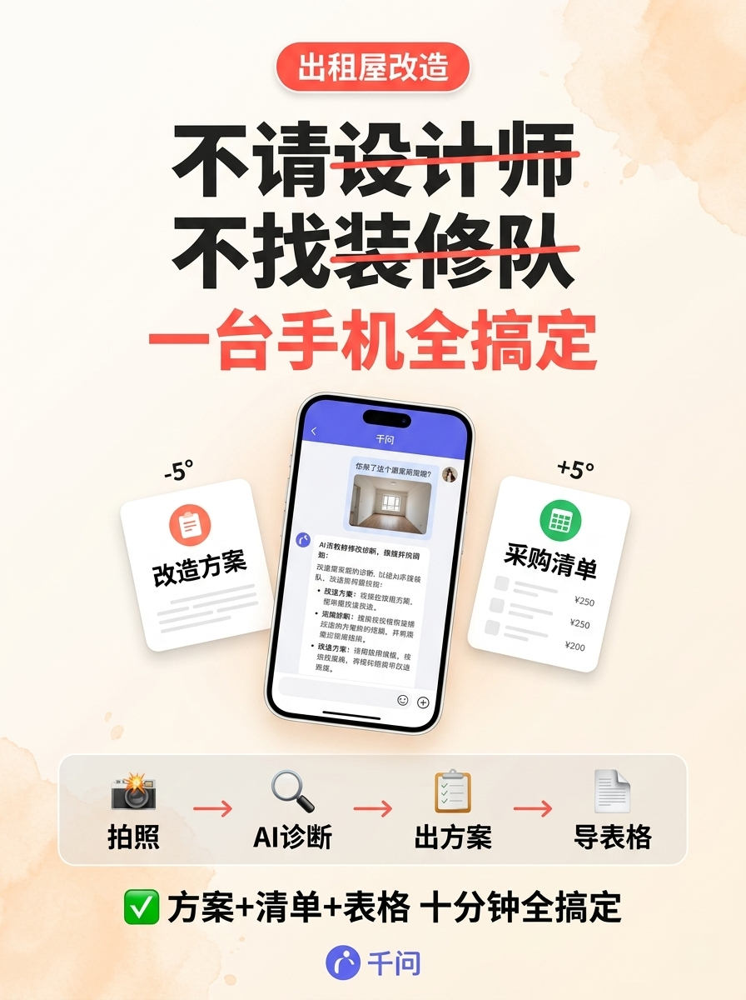

# OpenNoMark

[English](README.md) | **中文**

AI 生成图片水印检测与无痕去除工具。

基于 **OWLv2**（开放词汇目标检测）定位水印 + **LaMa**（大感受野图像修复）无痕重建，支持 Gemini、豆包、DALL-E 等主流 AI 平台的可见水印去除。

## 效果展示

### Google Gemini — 右下角菱形图标水印

上排为原图（带水印），下排为 OpenNoMark 去除后：

|  |  |  |
| :---: | :---: | :---: |
|  |  |  |
|  |  |  |

### 豆包 (Doubao) — 左上角 "AI 生成" 文字水印

上排为原图（带水印），下排为 OpenNoMark 去除后：

|  |  |  |
| :---: | :---: | :---: |
|  |  |  |
|  |  |  |

去除后区域由 LaMa 模型理解周围纹理并重建，无模糊涂抹痕迹。

| 平台 | 水印类型 | 位置 | 检测率 |
|------|---------|------|--------|
| Google Gemini | 菱形图标 | 右下角 | 100% |
| 豆包 (Doubao) | "AI 生成" 文字 | 左上角 | 85% |

## 快速开始

### 环境要求

- Python >= 3.10
- macOS (Apple Silicon MPS) / Linux / Windows (NVIDIA CUDA) / CPU
- 建议内存 >= 16GB
- NVIDIA GPU 用户请确保安装 CUDA 版 PyTorch（见 [pytorch.org](https://pytorch.org/get-started/locally/)）

### 安装

```bash
git clone https://github.com/NanmiCoder/OpenNoMark.git
cd OpenNoMark

# 使用 uv（推荐）
uv sync                     # 安装核心依赖
uv sync --extra api         # 如需 Web UI / API
cd frontend && npm install && cd ..

# 或使用 pip
pip install -e .
pip install -e ".[api]"     # 如需 Web UI / API
```

首次运行会自动下载模型：
- OWLv2 (~500MB, HuggingFace)
- LaMa (~196MB, GitHub Release)

### CLI 使用

```bash
# 单张图片
uv run opennomark image.png -o output/

# 多张图片
uv run opennomark img1.png img2.jpg img3.png -o output/

# 整个目录
uv run opennomark ./my_images/ -o output/

# 多个目录混合
uv run opennomark gemini_images/ doubao_images/ -o output/

# 带调试输出（保存检测框和 mask）
uv run opennomark ./images/ -o output/ --debug
```

### Web UI

**一键启动（推荐）：**

```bash
# macOS / Linux
./start.sh

# Windows
start.bat
```

自动安装依赖并同时启动前后端。

**手动启动：**

```bash
# 终端 1：启动后端
uv run uvicorn opennomark.api:app --port 48291

# 终端 2：启动前端
cd frontend && npm run dev
```

打开 `http://localhost:48292`，拖入图片即可使用。支持批量上传、before/after 对比预览、单张下载。

### Python API

```python
from opennomark.pipeline import WatermarkRemovalPipeline

pipeline = WatermarkRemovalPipeline()

# 单张处理
result_img, meta = pipeline.process("image.png", "clean_image.png")
print(meta)  # {'status': 'cleaned', 'watermarks_found': 1, ...}

# 批量处理
results = pipeline.process_batch(
    ["img1.png", "img2.jpg"],
    output_dir="output/",
    callback=lambda i, total, m: print(f"[{i}/{total}] {m['status']}")
)
```

## 项目结构

```
OpenNoMark/
├── opennomark/              # 核心 Python 包
│   ├── gemini_alpha.py      # Gemini 反向 Alpha 混合（linear-light, 严格门槛）
│   ├── detector.py          # OWLv2 水印检测
│   ├── inpainter.py         # LaMa 无痕修复（羽化 + alpha 混合）
│   ├── pipeline.py          # 智能分流 Pipeline
│   ├── cli.py               # CLI 命令行工具
│   ├── api.py               # FastAPI 后端
│   └── assets/              # 预计算的水印模板数据
├── frontend/                # React + Vite + Tailwind CSS 前端
│   └── src/App.tsx          # 主界面（拖拽上传 + before/after 对比）
├── tests/                   # 测试套件（42 个用例）
│   ├── test_detector.py     # 检测模块单元测试
│   ├── test_inpainter.py    # 修复模块单元测试
│   ├── test_pipeline.py     # Pipeline + E2E 测试
│   ├── test_cli.py          # CLI 集成测试
│   ├── test_api.py          # FastAPI 接口测试
│   └── test_skill.py        # Skill 格式验证
├── skill/                   # Claude Code Skill
│   └── opennomark.md
├── examples/                # 示例图片（含水印原图）
│   ├── gemini/              # Google Gemini 样本
│   └── doubao/              # 豆包样本
├── start.sh                 # 一键启动脚本（macOS / Linux）
├── start.bat                # 一键启动脚本（Windows）
├── pyproject.toml           # 项目配置
├── uv.lock                  # 依赖锁文件
└── LICENSE
```

## 技术原理

### 智能分流 Pipeline

```
原图 ┬─[Gemini sparkle 近乎完美匹配?]─是→ [linear-light 反向 Alpha] ┐
     │                        └─否──────────────────────────────┤
     └─→ [OWLv2 检测] → 角落过滤 → [LaMa 修复] ──────────────────┴→ 干净图
```

**路径 A — Gemini 反向 Alpha 混合（严格触发，理论无损）**：当 NCC 模板匹配 confidence ≥ 0.95 且反演后区域与周围背景灰度差 < 3 时，在 **linear-light 空间**执行反向 Alpha 混合 `original_linear = (watermarked_linear - α) / (1 - α)`，然后转回 sRGB。严格门槛是为了避免 alpha-map 与图像不对齐时的"塌陷 artifact"（sparkle 位置变成灰/黑菱形）。实际命中此路径的图像较少，主要是背景简单、Gemini 原生生成的场景。

**路径 B — OWLv2 + LaMa（主力）**：这是绝大多数图片的处理路径。OWLv2 (0.6B) 开放词汇目标检测定位水印候选，经位置/尺寸过滤后，由 LaMa 基于周围纹理重建。在 Gemini、豆包、DALL-E 等平台都有稳定表现。

| 平台 | 默认方法 | Alpha 快速路径 |
|------|---------|---------------|
| Google Gemini | OWLv2 + LaMa | 若匹配 ≥ 0.95 且边界一致 |
| 豆包 (Doubao) | OWLv2 + LaMa | — |
| DALL-E / 其他 | OWLv2 + LaMa | — |

### 硬件加速支持

设备默认自动选择，也可通过 `--device cuda|mps|cpu` 显式指定。

| 平台 | OWLv2（检测） | LaMa（修复） |
|------|---------------|--------------|
| Linux / Windows + NVIDIA CUDA | CUDA | CUDA |
| macOS (Apple Silicon) | MPS | CPU（MPS 不支持 LaMa 部分算子，自动回退） |
| CPU-only | CPU | CPU |

LaMa 的 TorchScript 模型为 CUDA 序列化，加载时 `map_location="cpu"` 以兼容非 NVIDIA 机器，之后再搬到目标设备。

## 测试

```bash
# 安装开发依赖
uv sync --extra dev

# 运行全部 42 个测试
uv run pytest tests/ -v

# 只跑单元测试
uv run pytest tests/test_detector.py tests/test_inpainter.py -v

# 只跑集成/E2E 测试
uv run pytest tests/test_pipeline.py tests/test_cli.py tests/test_api.py -v
```

## 已知限制

- OWLv2 是通用检测模型，对低对比度水印（如白底上的浅色文字）可能漏检
- 当前只处理角落位置的小型水印，不适用于全图铺满的大面积水印
- App 截图中的 UI 控件（返回箭头、设置图标）可能被误识别为水印

## 使用声明

本项目仅面向学术研究、技术学习与版权合规场景设计。使用者需遵守各 AI 平台的内容使用政策及所在地法律法规，不得用于侵犯他人知识产权或生成违规内容。

## License

[Apache-2.0](LICENSE)
